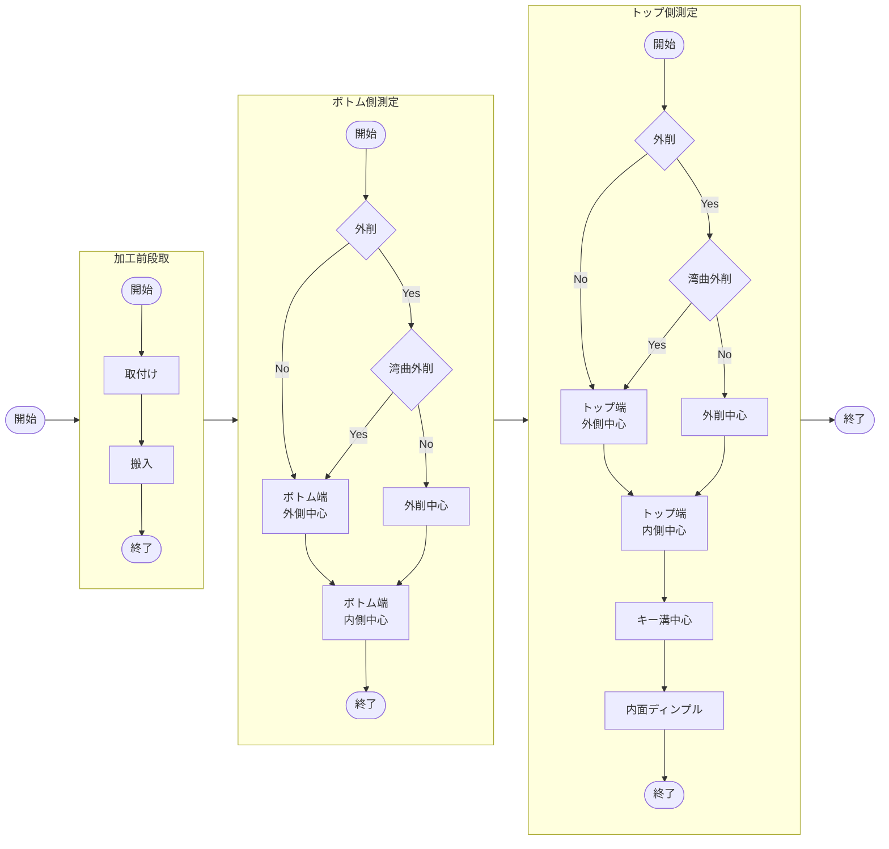

```mermaid
graph LR
    A0([開始]) --> Group1
    subgraph Group1[加工前段取]
        direction TB
        A1([開始]) --> A2
        A2[取付け] --> A3[搬入]
        A3 --> A4([終了])
    end
    Group1 --> Group2
    subgraph Group2[ボトム側測定]
        direction TB
        B1([開始]) --> B2{外削}
        B2 -->|No| B31
        B2 -->|Yes| B32
        B31[ボトム端<br> 外側中心] --> B4
        B32{湾曲外削}
        B32 -->|No| B321
        B32 -->|Yes| B31
        B321[外削中心] --> B4
        B4[ボトム端<br> 内側中心] --> B5([終了])
    end
    Group2 --> Group3
    subgraph Group3[トップ側測定]
        direction TB
        C1([開始]) --> C2{外削}
        C2 -->|No| C61
        C2 -->|Yes| C62
        C61[トップ端<br> 外側中心] --> C7
        C62{湾曲外削}
        C62 -->|No| C621
        C62 -->|Yes| C61
        C621[外削中心] --> C7
        C7[トップ端<br> 内側中心] --> C8
        C8[キー溝中心] --> C9
        C9[内面ディンプル] --> C10([終了])
    end
    Group3 --> H1([終了])
```
