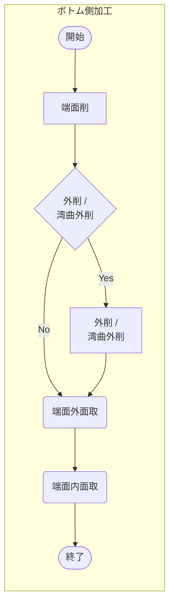

```mermaid
graph LR
    subgraph Group5[ボトム側加工]
        direction TB
        E1([開始]) --> E2
        E2[端面削] --> E3{外削 /<br> 湾曲外削}
        E3 -->|Yes| E4
        E3 -->|No| E5
        E4[外削 /<br> 湾曲外削] --> E5
        E5(端面外面取) --> E6
        E6(端面内面取) --> E7([終了])
    end
```
