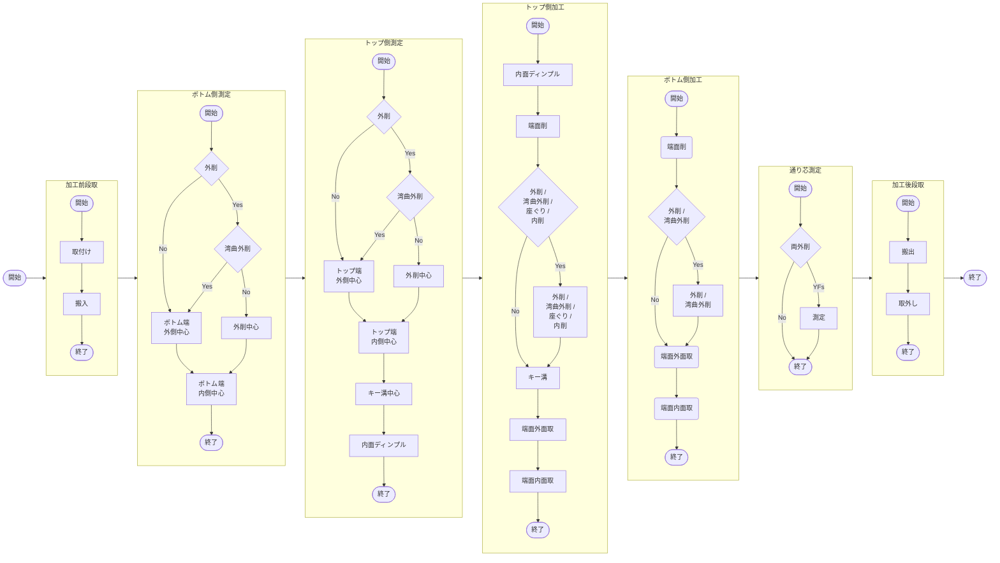

```mermaid
graph LR
    A0([開始]) --> Group1
    subgraph Group1[加工前段取]
        direction TB
        A1([開始]) --> A2
        A2[取付け] --> A3[搬入]
        A3 --> A4([終了])
    end
    Group1 --> Group2
    subgraph Group2[ボトム側測定]
        direction TB
        B1([開始]) --> B2{外削}
        B2 -->|No| B31
        B2 -->|Yes| B32
        B31[ボトム端\n 外側中心] --> B4
        B32{湾曲外削}
        B32 -->|No| B321
        B32 -->|Yes| B31
        B321[外削中心] --> B4
        B4[ボトム端\n 内側中心] --> B5([終了])
    end
    Group2 --> Group3
    subgraph Group3[トップ側測定]
        direction TB
        C1([開始]) --> C2{外削}
        C2 -->|No| C61
        C2 -->|Yes| C62
        C61[トップ端\n 外側中心] --> C7
        C62{湾曲外削}
        C62 -->|No| C621
        C62 -->|Yes| C61
        C621[外削中心] --> C7
        C7[トップ端\n 内側中心] --> C8
        C8[キー溝中心] --> C9
        C9[内面ディンプル] --> C10([終了])
    end
    Group3 --> Group4
    subgraph Group4[トップ側加工]
        direction TB
        D1([開始]) --> D2
        D2[内面ディンプル] --> D3
        D3[端面削] --> D4{外削 /\n湾曲外削 /\n座ぐり /\n 内削}
        D4 -->|Yes| D5
        D4 -->|No| D6
        D5[外削 /\n 湾曲外削 /\n 座ぐり /\n 内削] --> D6
        D6[キー溝] --> D7
        D7[端面外面取] --> D8
        D8[端面内面取] --> D9([終了])
    end
    Group4 --> Group5
    subgraph Group5[ボトム側加工]
        direction TB
        E1([開始]) --> E2
        E2(端面削) --> E3{外削 /\n 湾曲外削}
        E3 -->|Yes| E4
        E3 -->|No| E5
        E4[外削 /\n 湾曲外削] --> E5
        E5(端面外面取) --> E6
        E6(端面内面取) --> E7([終了])
    end
    Group5 --> Group6
    subgraph Group6[通り芯測定]
        direction TB
        F1([開始]) --> F2{両外削}
        F2 -->|YFs| F3[測定]
        F2 -->|No| F4
        F3 --> F4([終了])
    end
    Group6 --> Group7
    subgraph Group7[加工後段取]
        direction TB
        G1([開始]) --> G2
        G2[搬出] --> G3
        G3[取外し] --> G4([終了])
    end
    Group7 --> H1([終了])
```
