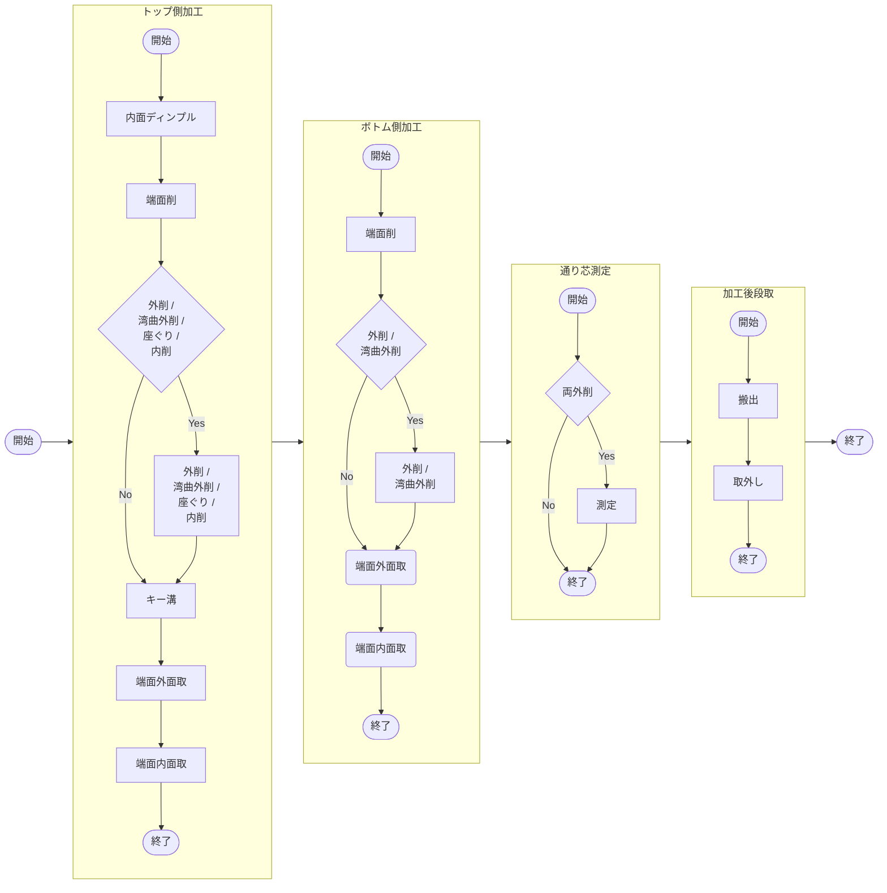

```mermaid
graph LR
    A0([開始]) --> Group4
    subgraph Group4[トップ側加工]
        direction TB
        D1([開始]) --> D2
        D2[内面ディンプル] --> D3
        D3[端面削] --> D4{外削 /<br>湾曲外削 /<br>座ぐり /<br> 内削}
        D4 -->|Yes| D5
        D4 -->|No| D6
        D5[外削 /<br> 湾曲外削 /<br> 座ぐり /<br> 内削] --> D6
        D6[キー溝] --> D7
        D7[端面外面取] --> D8
        D8[端面内面取] --> D9([終了])
    end
    Group4 --> Group5
    subgraph Group5[ボトム側加工]
        direction TB
        E1([開始]) --> E2
        E2[端面削] --> E3{外削 /<br> 湾曲外削}
        E3 -->|Yes| E4
        E3 -->|No| E5
        E4[外削 /<br> 湾曲外削] --> E5
        E5(端面外面取) --> E6
        E6(端面内面取) --> E7([終了])
    end
    Group5 --> Group6
    subgraph Group6[通り芯測定]
        direction TB
        F1([開始]) --> F2{両外削}
        F2 -->|Yes| F3[測定]
        F2 -->|No| F4
        F3 --> F4([終了])
    end
    Group6 --> Group7
    subgraph Group7[加工後段取]
        direction TB
        G1([開始]) --> G2
        G2[搬出] --> G3
        G3[取外し] --> G4([終了])
    end
    Group7 --> H1([終了])
```
