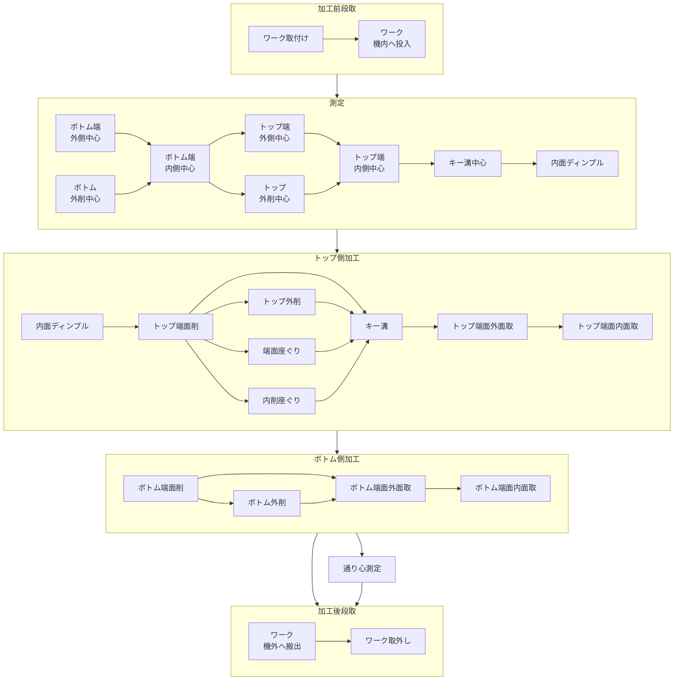

```mermaid
graph TB
    subgraph 加工前段取
        direction LR
        A1[ワーク取付け] --> A2[ワーク\n機内へ投入]
    end
    加工前段取 --> 測定
    subgraph 測定
        direction LR
        B11[ボトム端\n 外側中心]
        B12[ボトム\n 外削中心]
        B11 --> B2[ボトム端\n 内側中心]
        B12 --> B2
        B2 --> B31[トップ端\n 外側中心]
        B2 --> B32[トップ\n 外削中心]
        B31 --> B4[トップ端\n 内側中心]
        B32 --> B4
        B4 --> B5[キー溝中心]
        B5 --> B6[内面ディンプル]
    end
    測定 --> トップ側加工
    subgraph トップ側加工
        direction LR
        C1[内面ディンプル]
        C1 --> C2[トップ端面削]
        C2 --> C31[トップ外削]
        C2 --> C32[端面座ぐり]
        C2 --> C33[内削座ぐり]
        C2 --> C4
        C31 --> C4[キー溝]
        C32 --> C4
        C33 --> C4
        C4 --> C5[トップ端面外面取]
        C5 --> C6[トップ端面内面取]
    end
    トップ側加工 --> ボトム側加工
    subgraph ボトム側加工
        direction LR
        D1[ボトム端面削]
        D1 --> D2[ボトム外削]
        D1 --> D3
        D2 --> D3[ボトム端面外面取]
        D3 --> D4[ボトム端面内面取]
    end
    ボトム側加工 --> E1
    ボトム側加工 --> 加工後段取
        E1[通り心測定]
    E1 --> 加工後段取
    subgraph 加工後段取
        direction LR
        F1[ワーク\n機外へ搬出]
        F1 --> F2[ワーク取外し]
    end
```
