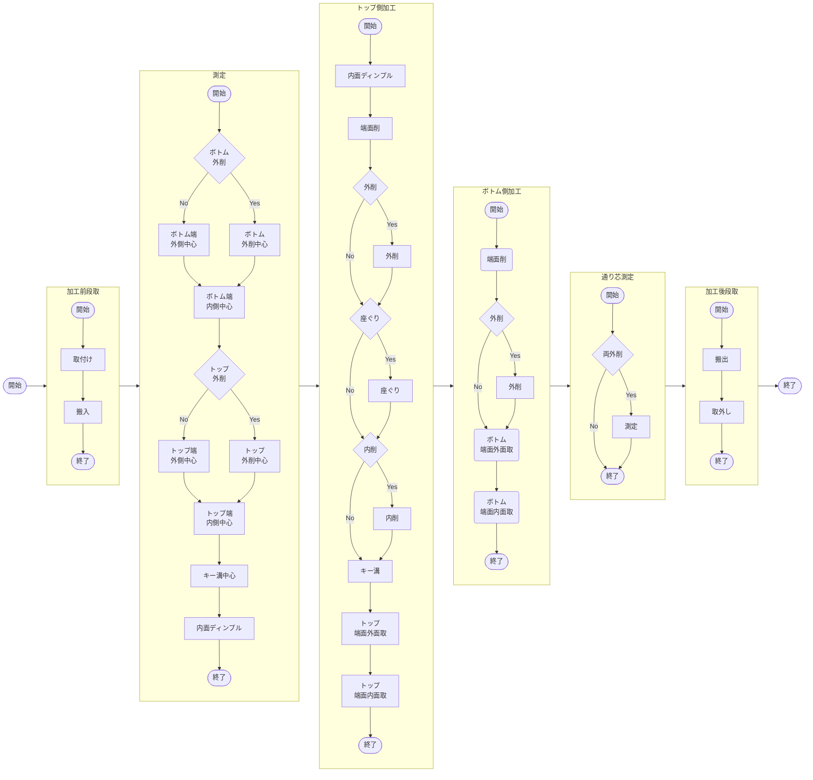

```mermaid
graph LR
    A0([開始]) --> Group1
    subgraph Group1[加工前段取]
        direction TB
        A1([開始]) --> A2
        A2[取付け] --> A3[搬入]
        A3 --> A4([終了])
    end
    Group1 --> Group2
    subgraph Group2[測定]
        direction TB
        B1([開始]) --> B2{ボトム\n外削}
        B2 -->|No| B31
        B2 -->|Yes| B32
        B31[ボトム端\n 外側中心] --> B4
        B32[ボトム\n 外削中心] --> B4
        B4[ボトム端\n 内側中心] --> B5{トップ\n外削}
        B5 -->|No| B61[トップ端\n 外側中心]
        B5 -->|Yes| B62[トップ\n 外削中心]
        B61 --> B7
        B62 --> B7
        B7[トップ端\n 内側中心] --> B8
        B8[キー溝中心] --> B9
        B9[内面ディンプル] --> B10([終了])
    end
    Group2 --> Group3
    subgraph Group3[トップ側加工]
        direction TB
        C1([開始]) --> C2
        C2[内面ディンプル] --> C3
        C3[端面削] --> C4{外削}
        C4 -->|Yes| C5
        C4 -->|No| C6
        C5[外削] --> C6{座ぐり}
        C6 -->|Yes| C7
        C6 -->|No| C8
        C7[座ぐり] --> C8{内削}
        C8 -->|Yes| C9
        C8 -->|No| C10
        C9[内削] --> C10
        C10[キー溝] --> C11
        C11[トップ\n端面外面取] --> C12
        C12[トップ\n端面内面取] --> C13([終了])
    end
    Group3 --> Group4
    subgraph Group4[ボトム側加工]
        direction TB
        D1([開始]) --> D2
        D2(端面削) --> D3{外削}
        D3 -->|Yes| D4
        D3 -->|No| D5
        D4[外削] --> D5
        D5(ボトム\n端面外面取) --> D6
        D6(ボトム\n端面内面取) --> D7([終了])
    end
    Group4 --> Group5
    subgraph Group5[通り芯測定]
        direction TB
        E1([開始]) --> E2{両外削}
        E2 -->|Yes| E3[測定]
        E2 -->|No| E4
        E3 --> E4([終了])
    end
    Group5 --> Group6
    subgraph Group6[加工後段取]
        direction TB
        G1([開始]) --> G2
        G2[搬出] --> G3
        G3[取外し] --> G4([終了])
    end
    Group6 --> H1([終了])
```
