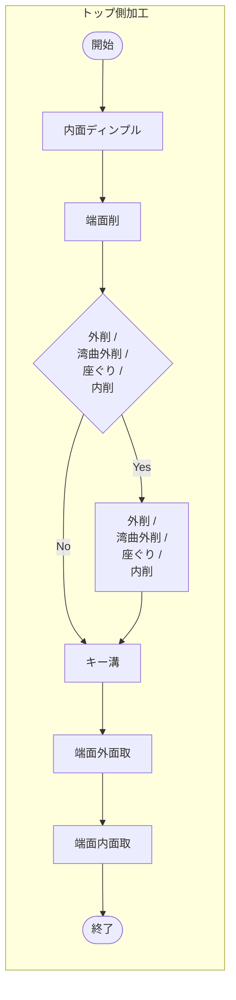

```mermaid
graph LR
    subgraph Group4[トップ側加工]
        direction TB
        D1([開始]) --> D2
        D2[内面ディンプル] --> D3
        D3[端面削] --> D4{外削 /<br>湾曲外削 /<br>座ぐり /<br> 内削}
        D4 -->|Yes| D5
        D4 -->|No| D6
        D5[外削 /<br> 湾曲外削 /<br> 座ぐり /<br> 内削] --> D6
        D6[キー溝] --> D7
        D7[端面外面取] --> D8
        D8[端面内面取] --> D9([終了])
    end
```
