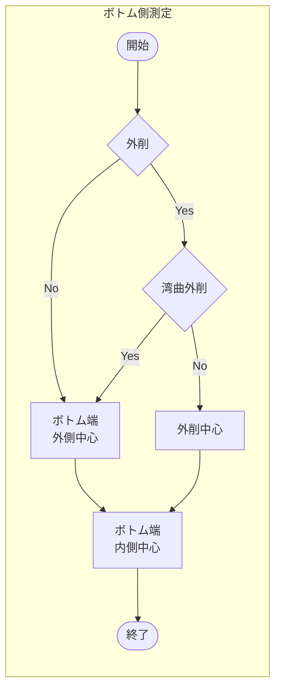

```mermaid
graph LR
    subgraph Group2[ボトム側測定]
        direction TB
        B1([開始]) --> B2{外削}
        B2 -->|No| B31
        B2 -->|Yes| B32
        B31[ボトム端<br> 外側中心] --> B4
        B32{湾曲外削}
        B32 -->|No| B321
        B32 -->|Yes| B31
        B321[外削中心] --> B4
        B4[ボトム端<br> 内側中心] --> B5([終了])
    end
```
