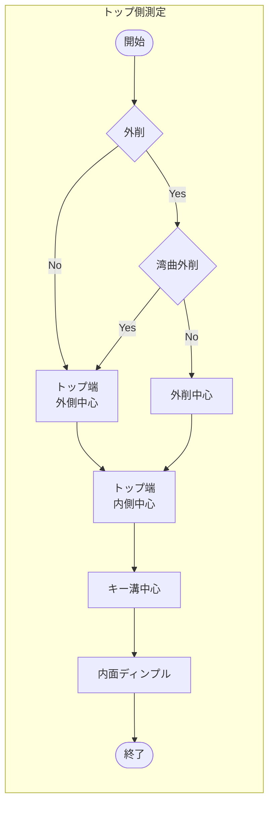

```mermaid
graph
    subgraph Group3[トップ側測定]
        direction TB
        C1([開始]) --> C2{外削}
        C2 -->|No| C61
        C2 -->|Yes| C62
        C61[トップ端<br> 外側中心] --> C7
        C62{湾曲外削}
        C62 -->|No| C621
        C62 -->|Yes| C61
        C621[外削中心] --> C7
        C7[トップ端<br> 内側中心] --> C8
        C8[キー溝中心] --> C9
        C9[内面ディンプル] --> C10([終了])
    end
```
